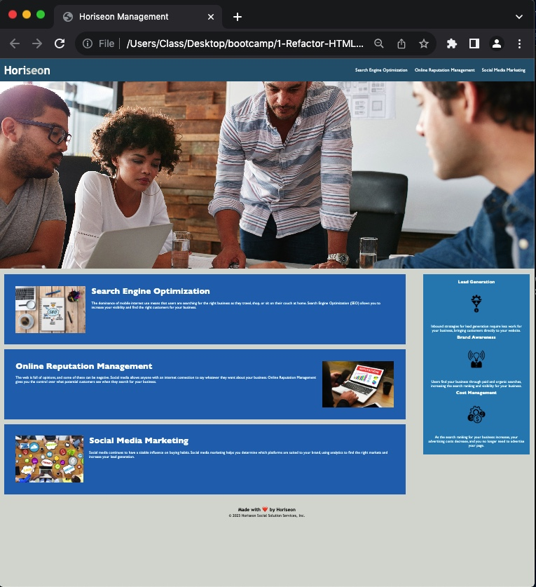

# 1-Refactor-HTML

## Description

This is project is refactoring a webpage in order to make it more accessable. This is done by making sure that all links work, and adding descriptive properties to the code as well as to the assets. This will allow users to utalize the web page even with a screen reader. We are learning to understand the code and it's actual purpose, because, in order to modify it, you need to understand what each asset is doing.

## Installation

This project can be downloaded (as a whole) and ran in Visual Studio Code with no additional modifications.

## Usage

https://m-r-urbanic.github.io/1-Refactor-HTML/

Use the above URL to view the corporate webpage and use the top navegation bar to navegate to any of the three articles in the main body of the page.

## Credits

Resources Used:
HTML Headings, W3 Schools, www.w3schools.com/html/html_headings.asp. 
HTML < img > alt Attribute, W3 Schools, www.w3schools.com/tags/att_img_alt.asp. 
HTML < title > Tag, W3 Schools, www.w3schools.com/tags/tag_title.asp. 
HTML Semantic Elements, W3 Schools, www.w3schools.com/html/html5_semantic_elements.asp. 

## License

MIT Liscense